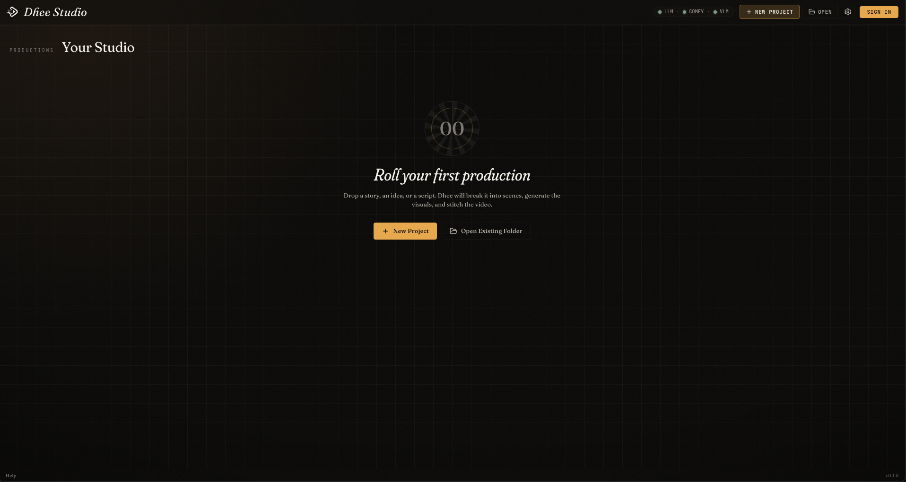
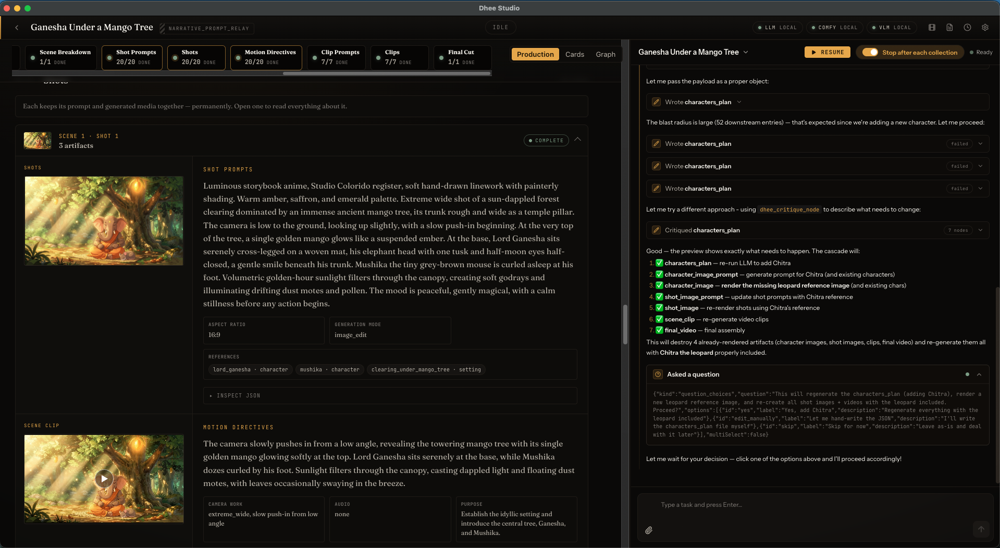
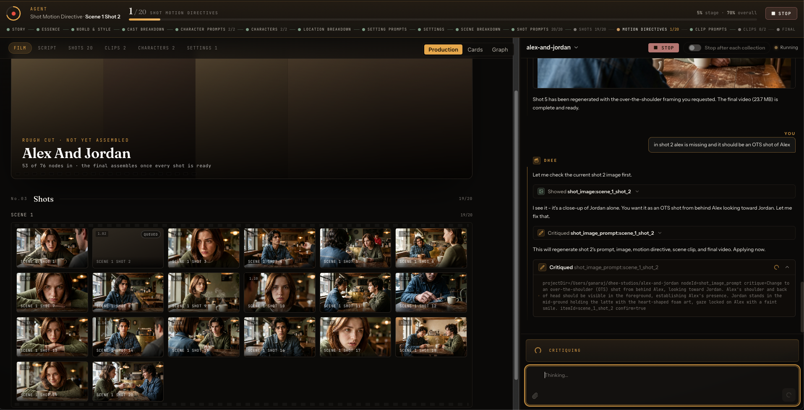
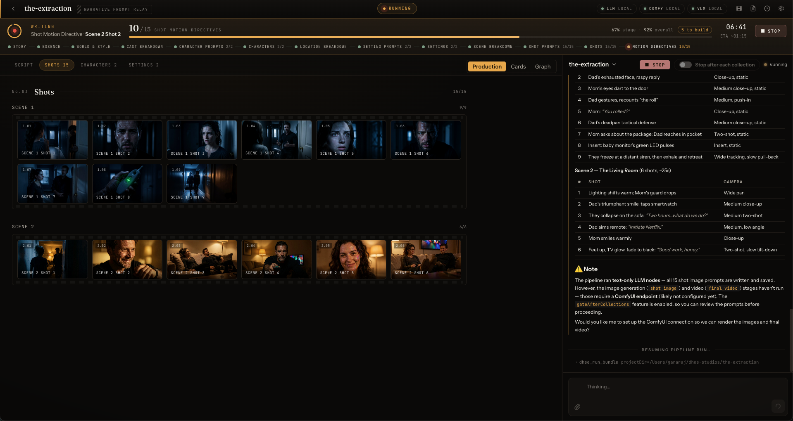
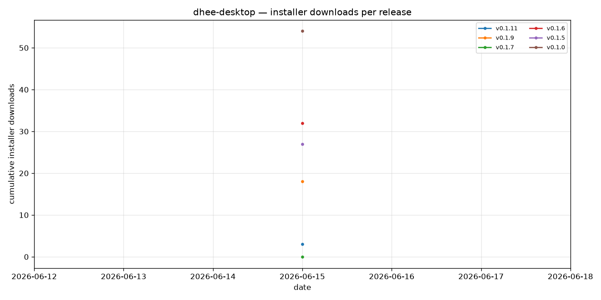

# Dhee Desktop

Electron desktop app for **dhee** — a local-first generative-media studio. It bundles the [`dhee-core`](https://github.com/dheeai/dhee-core) TypeScript engine and runs it **inside the Electron main process** — no separate server, no localhost port, no spawned CLI. The renderer talks to the embedded engine over a typed IPC bridge (see `src/shared/dheeIpc.ts`).

The app is **local-only**: the agent, the engine, and your projects all live on your machine, and there is no SaaS backend. Pointing ComfyUI at `https://cloud.comfy.org` (or any remote ComfyUI URL) in Settings → Connection is a separate, still-supported way to offload image/video generation — it does not make the app cloud-hosted.

## Screenshots

**Your Studio** — drop a story, an idea, or a script and Dhee breaks it into scenes, generates the visuals, and stitches the video.



**Production view** — every shot keeps its prompt and generated media together. The agent (docked right) explains its plan, runs the bundle, and regenerates individual nodes on your behalf.



**Film view** — the shots grid as a contact sheet while a run is live, with the agent making targeted edits (here: re-framing shot 2 as an over-the-shoulder shot) and cascading the change downstream.



**Live run** — scene-by-scene shot grid filling in as the pipeline walks the DAG, with stage progress across the top and the shot list on the right.



## How it embeds dhee-core

The Electron main process (`src/main/dheeCoreManager.ts`, logs as `DheeCoreManager`) lazy-imports `dhee-core` and owns the embedded engine for the lifetime of the app. There are two kinds of work:

- **Chat** — `buildPiSession` / `runAgentTurn` from `dhee-core` run an in-process agent (branded **dhee**) per chat session. Free-form interaction: the agent replies, calls tools, and decides what to do next.
- **Runs** — a `BackgroundTaskRunner` (from `dhee-core/runners`) kicks the bundle-DAG **walker** to actually generate a project. Long runs live on a dedicated background session so a chat message never blocks on a multi-hour render.

The old `ConversationManager` / `dhee-core/manager` entry point and the spawn-based server CLI are both gone — the desktop drives the engine purely in-process via the helpers above plus `dhee-core/dag` (node regen + event-log graph projections).

## Prerequisites

- Node.js 20+ and npm
- A sibling `dhee-core` checkout at `../dhee-core`
- ComfyUI for local image/video generation (or a remote/cloud ComfyUI URL)
- LM Studio, Gemini, or any OpenAI-compatible LLM credentials (OpenRouter works via the OpenAI-compatible path); a VLM provider (e.g. OpenRouter) for the optional fidelity judge

There is no Python backend. In a packaged build, ffmpeg ships with the app (via `@ffmpeg-installer`); native modules may still trigger an Electron rebuild on the build machine depending on dependency state.

## Development

### 1. Build the sibling `dhee-core`

```bash
cd ../dhee-core
pnpm install
pnpm build
```

The desktop imports the built `dist/` from `../dhee-core`, so it must exist before you start.

### 2. Install desktop dependencies

```bash
cd ../dhee-desktop
npm install
```

### 3. Start the app

```bash
npm start
```

Everything runs in-process — no subprocess is spawned and no localhost port is opened. You do not run `dhee-core` separately; you only need its `pnpm build` output to exist.

## Settings

Settings → Connection covers ComfyUI and the LLM provider for the embedded engine. Supported providers:

- LM Studio
- Gemini
- Any OpenAI-compatible provider (including OpenRouter)

A separate toggle controls the VLM judge used for the optional keyframe fidelity audit.

## Project format

A desktop project is an ordinary folder (no special extension):

```text
my-project/
├── project.json        Projected graph state (node statuses, bundleSource)
├── .dhee/
│   └── events.jsonl     Append-only event log — the source of truth
├── inputs/              Your inputs (story.md, …)
└── images/  videos/     Generated keyframes, clips, final cut
```

Every view in the app — the Inspector's Cards and Canvas, the version tray — is a **projection folded from `.dhee/events.jsonl`**. That's why the app can show node versions, branches, and time-travel (`asOfSeq`) without re-running anything.

## Runtime model

- `dheeCoreManager` (Electron main) lazy-imports `dhee-core` (chat: `buildPiSession` / `runAgentTurn`), `dhee-core/runners` (the `BackgroundTaskRunner` that drives the walker), and `dhee-core/dag` (regen + instance-graph projections).
- The renderer calls in via the typed `window.dhee.*` preload bridge (`src/main/preload.ts`), which `ipcRenderer.invoke`s the channels defined in `src/shared/dheeIpc.ts`.
- Streaming events flow main → renderer on a single `dhee:event` channel as `{ eventName, sessionId, data }`; `eventName` mirrors dhee-core's `ServerMessageType`.

## Packaging

`dhee-core` is bundled as a packed artifact, not a symlink (which avoids the old `file:../dhee-core` symlink problem inside packaged Electron apps):

1. **`verify:dhee-core`** — checks `../dhee-core` exists and its built library entry (`dist/index.js`) is present, then writes `release/app/.dhee-core-version.json`.
2. **`prepare:app-deps`** — `npm pack`s `../dhee-core` into `release/app/vendor`, rewrites `release/app/package.json` to depend on that tarball, and runs a production `npm install` in `release/app`.
3. **`build`** — builds the Electron main + renderer.
4. **`electron-builder build`** — packages `release/app` into the final installers.

```bash
npm run package        # mac + win
npm run package:mac    # macOS (arm64)
npm run package:win    # Windows
npm run package:linux  # Linux
npm run release        # build + publish
```

`package:*` multi-platform targets need substantially more disk than a single-platform build.

### What ships inside the bundled dhee-core

The packed tarball carries the engine's `dist/` (which includes the first-party bundles and the agent skill) plus `prompts/` and `workflows/` — required at runtime for engine startup, prompt loading, the agent's system prompt, ComfyUI workflow loading, and the default bundles.

## IPC API

There is no network protocol — the renderer talks to the embedded engine over typed Electron IPC. All channels and payload shapes live in `src/shared/dheeIpc.ts`; the renderer-facing surface is `window.dhee.*` (`src/main/preload.ts`).

### Renderer → main (request/response)

| Channel | Purpose |
|---------|---------|
| `dhee:createSession` | Create (or resume) a chat session — `interactive` or `background` role |
| `dhee:configureProject` | Bind a session to a project + bundle |
| `dhee:focusProject` | Switch the session to an existing project on disk |
| `dhee:chatPrompt` | Send a free-form message to the session's agent; returns text + tool calls |
| `dhee:runTask` | Dispatch a bundle run (kicks the walker via `BackgroundTaskRunner`); streams on `dhee:event` |
| `dhee:sendResponse` | Reply to an `agent_question` |
| `dhee:cancelTask` | Cancel the in-flight chat turn |
| `dhee:runnerCancel` / `dhee:runnerStatus` | Cancel / snapshot the active background run (independent of any chat session) |
| `dhee:redoNode` | Edit a prompt + invalidate dependents + resume |
| `dhee:invalidateNodes` | Mark nodes pending without resuming (Prompts-tab edit flow) |
| `dhee:writeNodeContent` | Overwrite a node's content with user-edited bytes (cascades downstream) |
| `dhee:resolveBundle` | Resolve a `bundleSource` to its node graph (Inspector / project tiles) |
| `dhee:resolveInstanceGraph` | Fold `.dhee/events.jsonl` into an instance graph (Inspector Cards) |
| `dhee:listVersions` / `dhee:selectVersion` | List / pick a node's candidate versions |
| `dhee:listWorkflows` · `getWorkflow` · `updateWorkflow` · `deleteWorkflow` · `validateWorkflow` | Custom ComfyUI workflow management (Settings → Workflows) |
| `dhee:setAutonomous` / `setPiOversight` / `setVlmJudge` | Session toggles |
| `dhee:getHistory` / `clearChatHistory` | Read / reset the persisted chat transcript |
| `dhee:deleteSession` | Tear down a session |

### Main → renderer (streaming events)

All events publish on the single `dhee:event` channel as `{ eventName, sessionId, data }`:

`progress`, `tool_call`, `tool_result`, `todo_updated`, `agent_response`, `agent_question`, `status`, `stream_chunk`, `context_usage`, `phase_transition`, `timeline_update`, `notification`, `project_focused`, `media_generated`, `session_status`.

## Project structure

```text
dhee-desktop/
├── src/
│   ├── main/        Electron main: dheeCoreManager, IPC bridge, preload, settings
│   ├── renderer/    React UI (chat, landing, Inspector canvas/cards)
│   └── shared/      IPC + type contracts (dheeIpc.ts, chatTypes.ts, …)
├── .erb/scripts/    Build / packaging helpers (verify-dhee-core, install-app-deps, …)
├── release/app/     Packaging staging dir
└── assets/
```

## Testing

```bash
npm test            # Jest unit tests
npm run test:e2e    # Playwright end-to-end
npm run lint
```

## Release downloads



